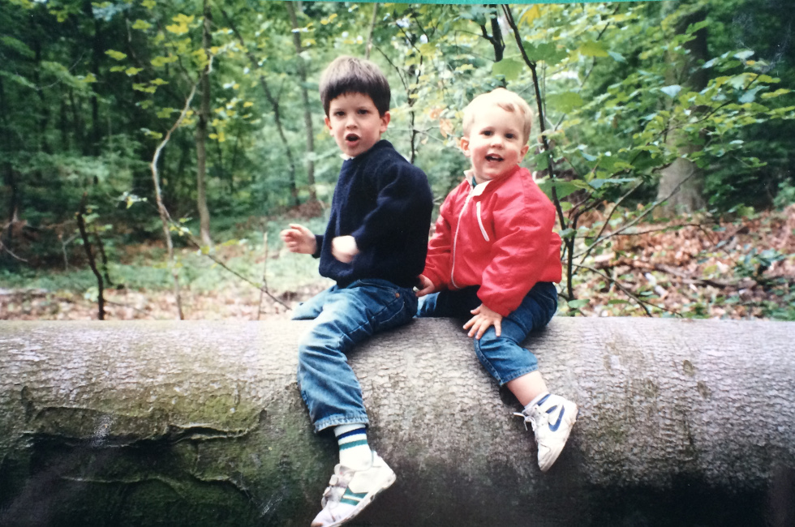
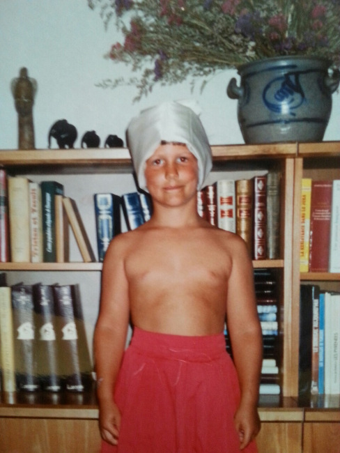
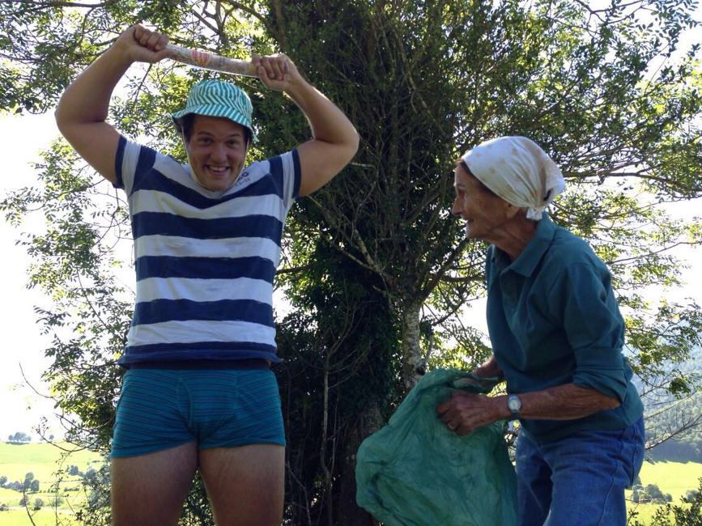
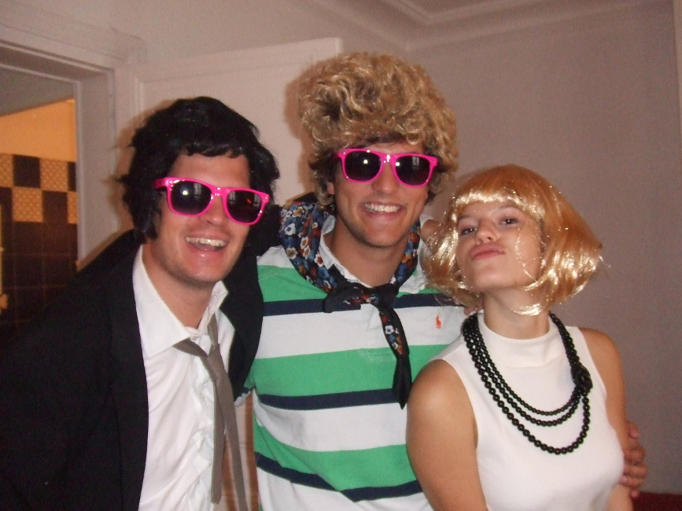
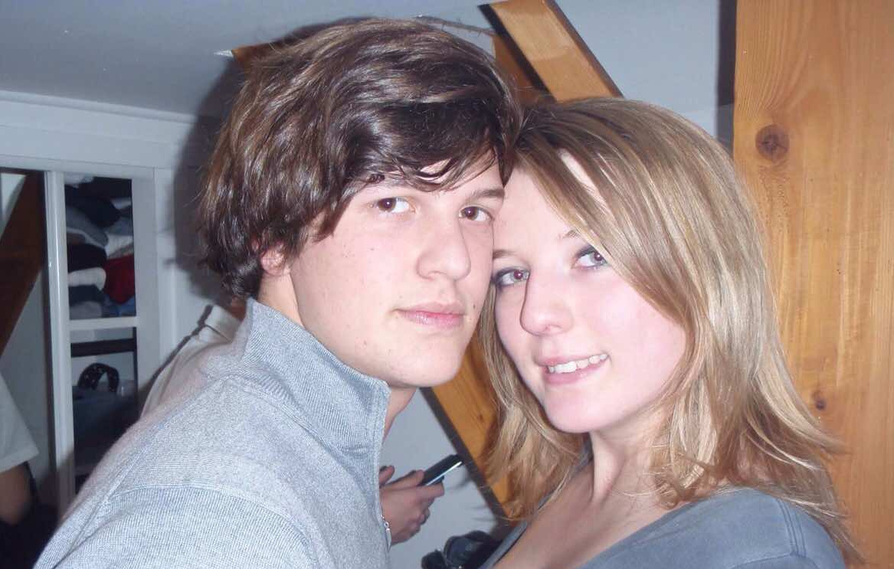
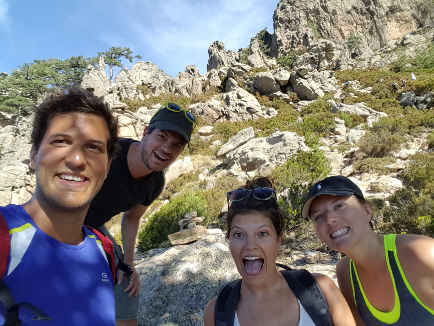

## TODO :
## Mariage Coco-Momo

- Acheter un costume
- Prendre les billets pour Paris et Bernay
- Faire la valise
- Écrire un discours

notes:
G : Allo Lulu ? Tu sais que c’est le mariage de Morgane et Colin ce week-end ?

(L : bah oui oui je sais, j’ai fait 150 livrets de messe le week-end dernier avec Morgane je peux te dire que je m’en souviens)  T’as préparé un discours au fait ?

G : Non, mais j’ai commencé à récupérer quelques photos de Colin quand il était petit...

L : Faut vraiment qu’on s’active. En même temps c’est pas facile y’a tellement de chose à raconter, et tellement à pas raconter aussi…

G : oui et puis parler devant 200 personnes, l’angoisse…

L : C’est clair..

G : T’as quoi comme photos toi ?

---

notes:
L : Y’a celle-ci où il est vraiment trop mimi.

G : C’était à l’époque où t’existais pas encore ça ! C’est vrai qu’il était blond quand il était petit … T’es sur que c’est notre frère d’ailleurs ?

L : Je pense que ça ne fait plus aucun doute  aujourd’hui ! Quand j’étais petite il arrêtait pas de dire que j’avais été adoptée.. Surement pour m’embêter !

G : Pour t’embêter ? Coco ? C’est pas son genre

L : C’était comment quand j’étais pas encore né ?

---

notes:
G : C'était cool, on pouvait jouer au foot pénard

---

notes:
G : Il me suivait partout...

---

notes:
G : Il faisait tout comme moi. Même le clown !

L : C'est toi qui lui a tout appris en fait !

G : Ouais enfin... l'élève a quand même bien dépassé le maitre !

G : Tiens, j'ai retrouvé celle là aussi

---

notes:
L : Regarde-moi ce phénomène, puis déjà plutôt gainé !

G : Je crois que c'était une soirée déguisement à Bizanos, il a l'air trop fier en plus !

---

notes:
G : 25 ans plus tard toujours un phénomène

L: Ah oui, je me souviens, on avait fait une rando avec mamie

G : à chateau ?

L : Non plus loin dans la pampa

---

notes:
G: Faut dire qu’il n’est pas aidé le pauvre, entre sa famille et ses amis, ça vole pas haut

L : D'où est-ce que tu as ressorti cette photo ?

G : C'était une soirée 70th avec la famille

L : Classique quoi

---

notes:
L : Même au ski ça s'arrange pas... Pas un pour rattrapper l'autre

G : Ah bah la montagne, c'est peut-être bien le seul endroit où il ne s'est rien cassé...

---

notes:
L : Parce qu'on peut pas le nier, il est quand même Kascou le Coco ! Toujours à faire des excentricités...

---

notes:
G : Et il a l'air content !

G : ça s'est pas arrangé depuis qu'il fait du rugby

L : T'es sûr que c'était pas plutôt à une 3e mi-temps ?

G : Peut-être...

---

notes:
L : En parlant de rugby, Regarde-moi ce beau gosse

L : Un avant qui met des essais, c'est beau..

---

notes:
G : Quand même, depuis qu'il a rencontré Morgane, il s'est appaisé...

L : et nous aussi !

L : Heureusement qu'elle est là pour le canaliser de temps en temps.

G :Tu te souviens la première fois que tu l’a rencontré ?

---

notes:
L : Oui, j’étais toute petite, on habitait rue du regard et je me souviens de la première fois où elle venue, je me suis dit : waaah, qu'est-ce qu'elle est belle, en plus elle est blonde et elle fait de la natation !

---

notes:
G : on se marre bien quand même tous les 4 !

L : Ouais, on aurait pas mieux rêvé comme belle-sœur honnêtement, enfin c’est pas pour te mettre la pression mon Guigui mais la barre est très haute là.

G :C'est claire. Bon, je crois qu'on a plus le temps de préparer un discours...

L : C'est pas très grave, en gros il faut dire le principal :

Tout les deux :

on vous aime

vous êtes des énormes pidji

on sait que vous allez faire des belles pépites

et ce soir on est les plus heureux !
