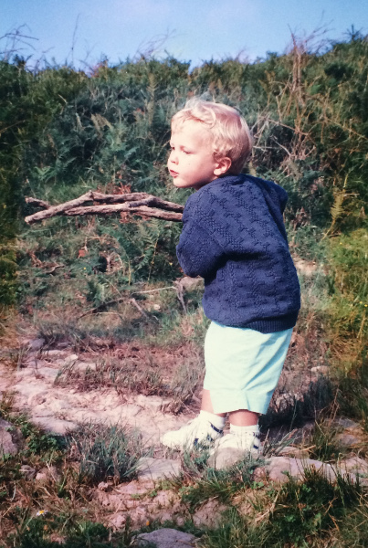
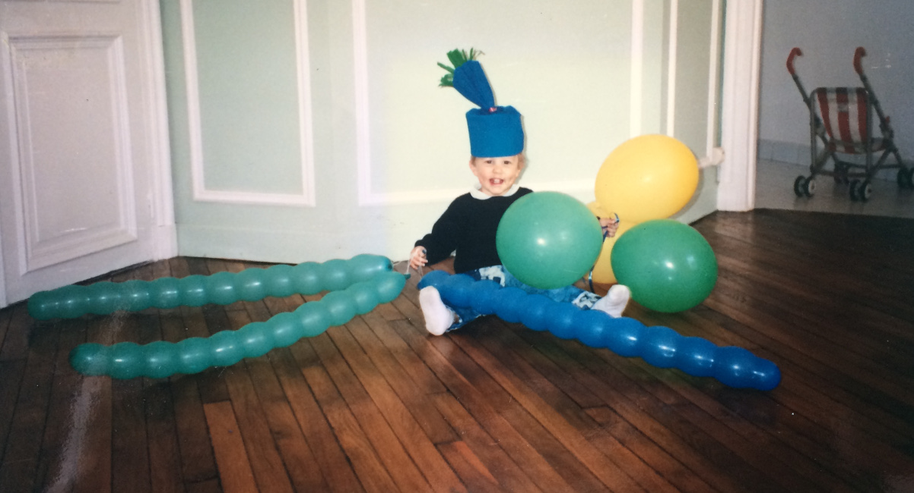
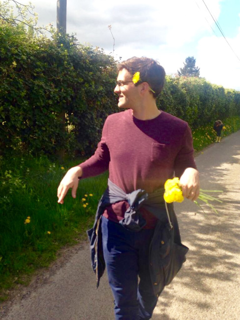
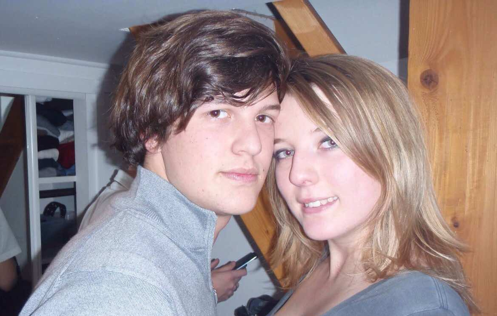
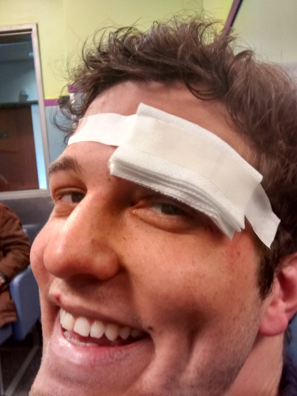
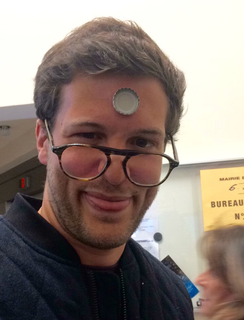

# Cas clinique
## de M. C et MME. M

notes:
Chers collègues, merci d'être venu aussi nombreux pour la présentation de notre cas clinique concernant le patient C. et la patiente M.

Les symptômes exrimés par ces deux patients sont en effet très atypiques et nous nous devons de vous faire la synthèse de l'ensemble de nos travaux de recherche à ce sujet.

Commencons par le patient C.

---

# Monsieur C.

notes:
Jeune homme, agé de 27 ans, ayant un certains nombres d'antécédents médicaux, et pas des moindres :...

---

notes:
Toujours à faire des exentricités principalement à cause d'un terrain familial faorisant ce type de comportement.
(1/2)

---

notes:
Toujours à faire des exentricités principalement à cause d'un terrain familial faorisant ce type de comportement.
(2/2)

---

notes:
Mais souvent livré à lui-même.

---

notes:
Casse-cou

---

notes:
Plus de 35 consultations aux urgences de l'Hopital Necker à Paris, entre 2 et 13 ans

---

## Traitement

notes:
Pas de traitement particulier en dehors d'un verre de Kikoupumplemouss' de façon occasionnelle. [enregistrement]

---

### Histoire de la maladie

notes:
HDM: Depuis 2007, il semblerait que monsieur C se soit calmé. Nous n'avons pas tout de suite trouver de cause à cet effet mais après de nombreuses études faites à ce sujet, il semblerait que ce phénomène soit lié à la rencontre de Mlle M.

---

notes:
Trouble du comportement

---

notes:
Développement capilaire anarchique (1/2)

---

notes:
Développement capilaire anarchique (2/2)

---

notes:
Développement physique et musculaire

---

notes:
Conduite à risque

---

notes:
perte de factultés intelectuelles

---

# Madame M.

notes:
Certains de ces symptomes ont tout des suites été repérés par nos confrères chez le deuxième sujet, Morgane, agé de 27 ans.

---

<!-- .element: class="fragment" data-fragment-index="1" -->
