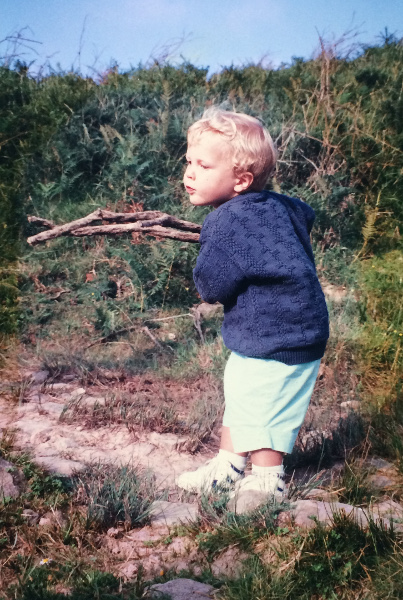
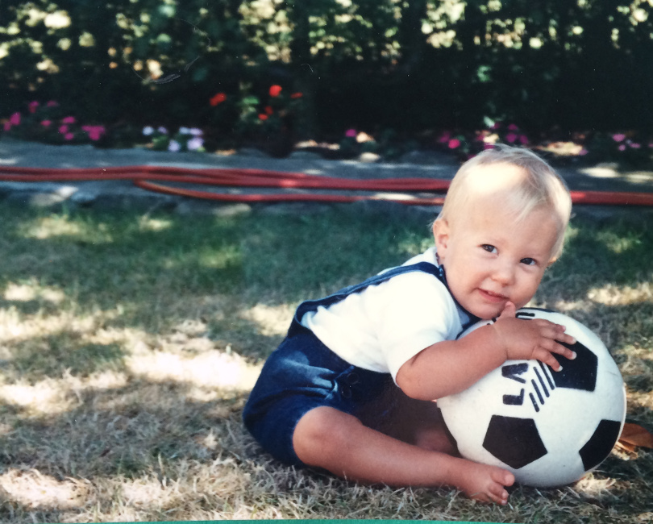
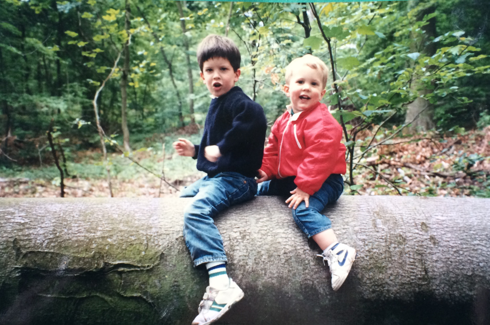
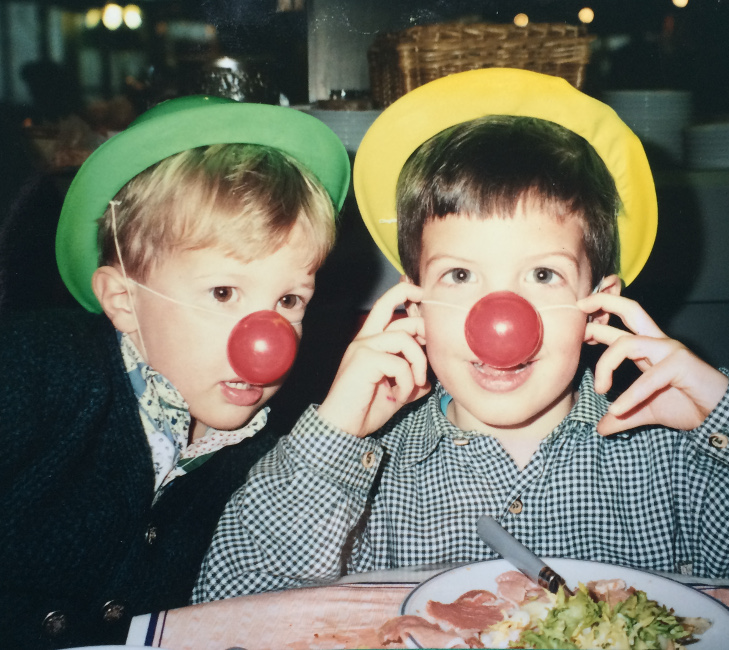
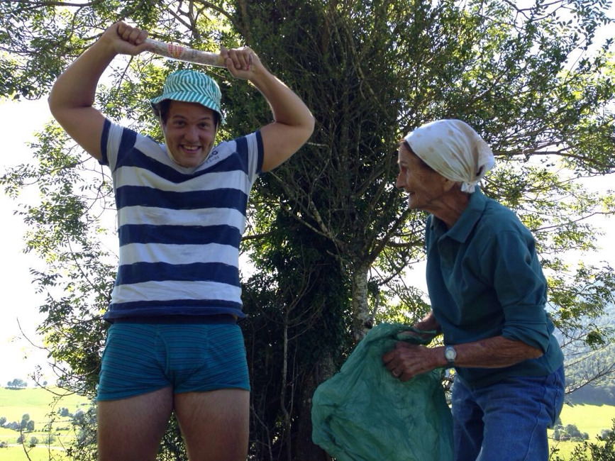
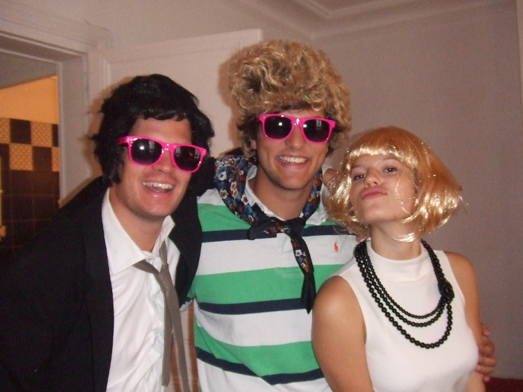
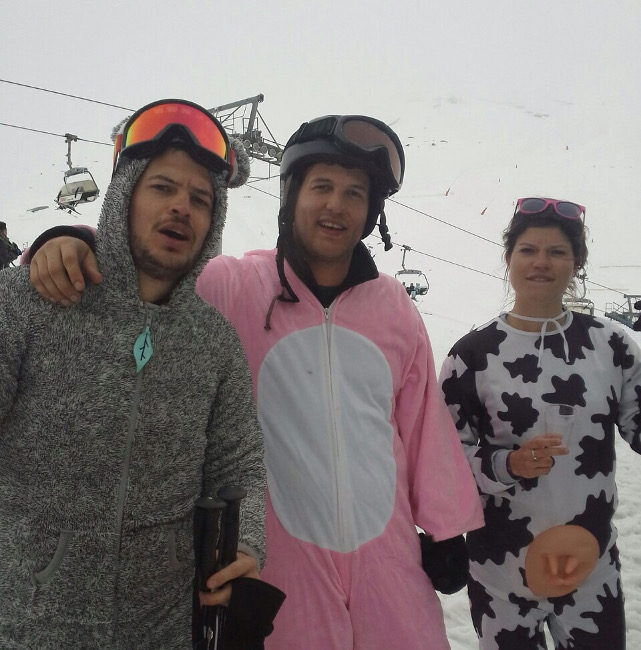
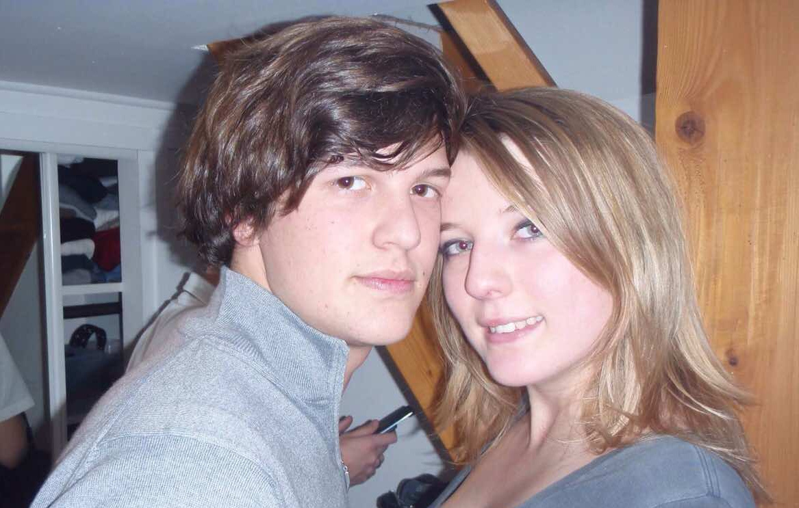

notes:
G : Allo Lulu ? Tu sais que c’est le mariage de Morgane et Colin ce week-end ?

(L : bah oui oui je sais, j’ai fait 150 livrets de messe le week-end dernier avec Morgane je peux te dire que je m’en souviens)  T’as préparé un discours au fait ?

G : Non, mais j’ai commencé à récupérer quelques photos de Colin quand il était petit...

L : Faut vraiment qu’on s’active. En même temps c’est pas facile y’a tellement de chose à raconter, et tellement à pas raconter aussi…

G : oui et puis parler devant 200 personnes, l’angoisse…

L : C’est clair..

G : T’as quoi comme photos toi ?

---

notes:
L : Y’a celle-ci où il est vraiment trop mimi.

G : C’était à l’époque où t’existais pas encore ça ! C’est vrai qu’il était blond quand il était petit … T’es sur que c’est notre frère d’ailleurs ?

L : Je pense que ça ne fait plus aucun doute  aujourd’hui ! Quand j’étais petite il arrêtait pas de dire que j’avais été adoptée.. Surement pour m’embêter !

G : Pour t’embêter ? Coco ? C’est pas son genre

L : C’était comment quand j’étais pas encore né ?

---

notes:
G : C'était cool, on pouvait jouer au foot pénard

---

notes:
G : Il me suivait partout...

---

notes:
G : Il faisait tout comme moi.
[Histoire ciseau.]

---

notes:
L : Regarde-moi ce phénomène

---

notes:
G : Bah ça a pas changé , 25 ans plus tard toujours le même

---

notes:
G: Faut dire qu’il n’est pas aidé le pauvre, entre sa famille et ses amis, ça vole pas haut

---

notes:
L : Haha oui je me souviens. Et puis qu’est-ce qu’il a pu faire comme excentricités... Un vrai bout en train !

---

notes:
G : Heureusement que Morgane est là pour le canaliser de temps en temps. Tu te souviens la première fois que tu l’a rencontré ?

---

notes:
L : Oui, j’étais toute petite, on habitait rue du regard et je me souviens de la première fois où elle venue, je me suis dit : waaah, elle est trop belle elle est blonde et en plus elle fait de la natation

L : On aurait pas mieux rêvé comme belle-sœur honnêtement, enfin c’est pas pour te mettre la pression mon Guigui mais la barre est très haute là.

---

notes:
Diapo de fin

---
